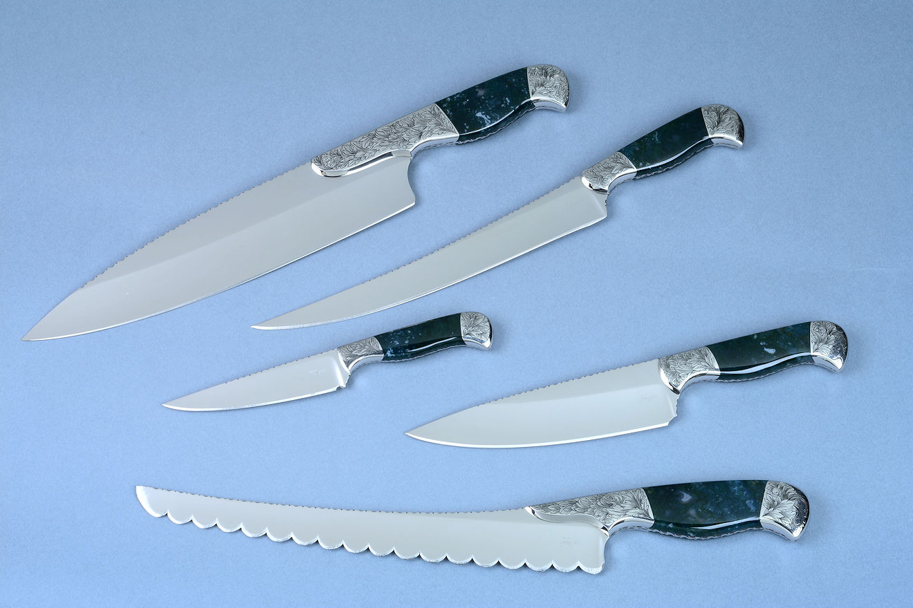
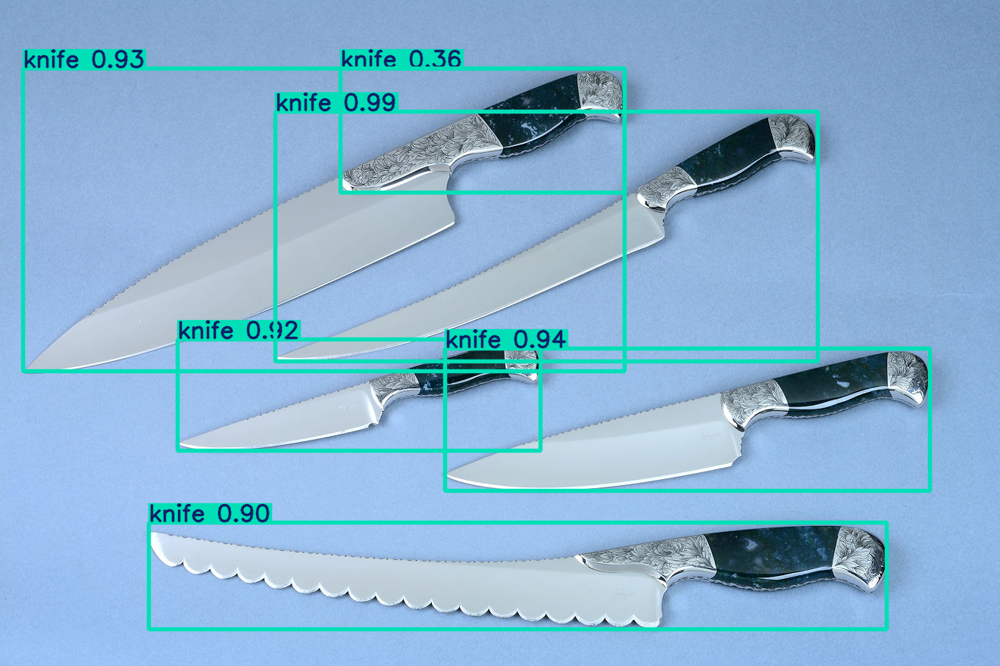

## Теоретическая база

Глубокие нейронные сети представляют собой тип искусственных нейронных сетей, состоящих из множества слоев между входным и выходным слоями. Эти сети способны автоматически извлекать сложные паттерны и высокоуровневые признаки из данных, что делает их особенно эффективными для задач, таких как распознавание изображений, обработка естественного языка и распознавание речи.

Глубокое обучение – это подход к машинному обучению, который основывается на использовании многослойных нейронных сетей для автоматического извлечения высокоуровневых признаков из сложных данных.

Нейронные сети, в свою очередь, являются математическими моделями, которые состоят из множества взаимосвязанных нейронов, работающих вместе для решения задачи. Глубокие нейронные сети имеют множество слоев, которые позволяют им изучать более сложные функции и паттерны в данных.

Обучение нейронных сетей – это процесс определения оптимальных значений параметров нейронной сети, которые минимизируют ошибки на обучающих данных. Это достигается путем минимизации функции потерь, которая измеряет расхождение между предсказаниями нейронной сети и правильными ответами на обучающей выборке.

##### Архитектура:
Архитектура нейронных сетей описывает структуру и организацию нейронной сети, включая количество слоев, количество нейронов в каждом слое, функции активации, методы оптимизации и другие параметры, которые определяют, как сеть будет обрабатывать входные данные и выдавать выходные результаты.

###### Прямые нейронные сети (Feedforward neural networks)
Прямые нейронные сети называют многослойными персептронами. Они состоят из входного слоя, нескольких скрытых слоев и выходного слоя. Каждый слой состоит из нейронов, которые обрабатывают входные данные и передают их следующему слою. Прямые нейронные сети часто используются для задач классификации и регрессии, в частности, для классификации изображений, предсказания стоимости недвижимости, распознавании речи и т.п.

###### Рекуррентные нейронные сети (Recurrent neural networks)
Рекуррентные нейронные сети имеют обратные связи между нейронами, что позволяет им моделировать последовательные данные, такие как текст или временные ряды. Они состоят из слоев с памятью, которые могут хранить информацию о предыдущих входах и использовать ее для обработки последующих входов.

###### Сверточные нейронные сети (Convolutional neural networks)
Сверточные нейронные сети используются для обработки входных данных с пространственной структурой, таких как изображения. Они используют свертку для извлечения признаков из изображения и пулинг для уменьшения размерности извлеченных признаков. Затем извлеченные признаки передаются через полносвязные слои для классификации. Несложно догадаться, что эти сети позволяют классифицировать изображения, распознавать объекты на изображениях, сегментировать изображения и т.д.

###### Автокодировщики (Autoencoders)
Автокодировщики – это нейронные сети, которые используются для обучения представлений данных путем сжатия информации из входного слоя в скрытый слой и затем расшифровки обратно в выходной слой. Они широко используются для задач сжатия данных (к примеру, изображений или звука), визуализации данных и удаления шумов.

###### Глубокие вероятностные модели (Deep probabilistic models)
Глубокие вероятностные модели – это класс нейронных сетей, которые используются для описания распределения вероятности входных данных. Они используются для генерации новых данных, классификации и регрессии.

###### Генеративно-состязательные сети (Generative adversarial networks)
Генеративно-состязательные сети состоят из двух нейронных сетей: генератора и дискриминатора, которые конкурируют друг с другом в процессе обучения. Генератор пытается создать новые примеры, похожие на обучающие данные, а дискриминатор оценивает, насколько хорошо генератор создает поддельные примеры. Они широко используются для генерации фотографий, музыки и других типов данных.

###### Для реализации нейросетевых вычислений можно использовать:

1. CPU подходит для небольших моделей и задач с низкими требованиями к производительности.

2. GPU: обеспечивает высокую производительность и параллельные вычисления, что важно для работы с большими объемами данных и сложными моделями.

## Описание разработанной системы (алгоритмы, принципы работы, архитектура) 
Для выполнения задачи была выбрана предобученную модель YOLO - You Only Look Once.
Версия 11 (последняя).

0: 384x640 1 knife, 458.1ms
Speed: 15.5ms preprocess, 458.1ms inference, 9.5ms postprocess per image at shape (1, 3, 384, 640)

Оптимизация путём предварительной обработки изображения:
0: 384x640 1 knife, 412.7ms
Speed: 3.5ms preprocess, 412.7ms inference, 12.1ms postprocess per image at shape (1, 3, 384, 640)

0: 448x640 6 knifes, 557.8ms
Speed: 8.3ms preprocess, 557.8ms inference, 9.1ms postprocess per image at shape (1, 3, 448, 640)

Оптимизация путём предварительной обработки изображения:
0: 448x640 6 knifes, 446.1ms
Speed: 3.8ms preprocess, 446.1ms inference, 13.5ms postprocess per image at shape (1, 3, 448, 640)

0: 640x640 3 knifes, 786.8ms
Speed: 9.2ms preprocess, 786.8ms inference, 8.4ms postprocess per image at shape (1, 3, 640, 640)

Оптимизация путём предварительной обработки изображения:
0: 640x640 2 knifes, 625.5ms
Speed: 3.0ms preprocess, 625.5ms inference, 8.5ms postprocess per image at shape (1, 3, 640, 640)

## DOCS && LINKS:

https://arxiv.org/abs/1506.02640
https://docs.ultralytics.com/models/yolo11/#key-features
https://docs.ultralytics.com/tasks/detect/#models